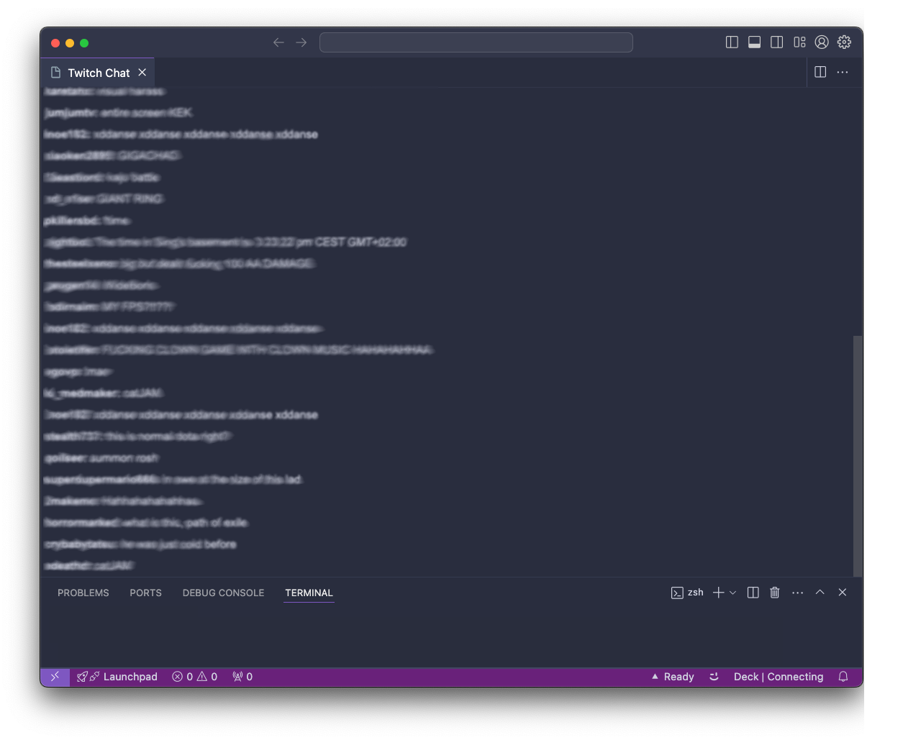

# Twitch chat for VS Code

View what's going on in chat while you're busy in the editor

## Features

-   Input any Twitch username
-   See chat in real time

## How to use
1. Install the extension
2. Open your VSCode settings and search for `twitchChatExtension.twitchUsername`, and input your Twitch username
3. Open the command palette (`Ctrl+Shift+P` or `Cmd+Shift+P` on Mac) and search for `Twitch Chat`

## Extension Settings

This extension contributes the following settings:

-   `twitchChatExtension.twitchUsername`: Sets the username of the channel you wish to show in the extension

## Known Issues

-   No badge/emote support

## Release Notes

Users appreciate release notes as you update your extension.

### 1.0.0

Initial release

-   Setting for adding username
-   Shows chat in real time

### 1.0.1

- Adding images
- Updating the branding of the extension such as renaming and adding an image
- Updated the `README` to show how to use the extension

---

## Contribution Guidelines

Thank you for your interest in contributing to the Twitch Chat Extension for Visual Studio Code! This was developed for my own needs, but I welcome contributions from the community to help improve and enhance the extension.

To contribute to this project, please follow these guidelines:

### Reporting Issues

If you encounter any bugs, have feature requests, or want to suggest improvements, please [open an issue](https://github.com/tommerty/vscode-twitch-chat/issues) on the GitHub repository. When reporting an issue, please provide the following information:

-   A clear and descriptive title
-   Steps to reproduce the issue
-   Expected behavior and actual behavior
-   Screenshots or error messages, if applicable
-   Visual Studio Code version and extension version

### Pull Requests

We welcome pull requests for bug fixes, new features, or improvements. To submit a pull request, please follow these steps:

1. Fork the repository and create a new branch for your feature or bug fix.
2. Ensure that your code adheres to the project's coding style and conventions.
3. Write clear and concise commit messages.
4. If your pull request addresses an existing issue, please reference the issue number in your commit message or pull request description.
5. Make sure that your changes do not introduce any new errors or warnings.
6. Test your changes thoroughly to ensure they work as expected.
7. Submit the pull request, providing a detailed description of the changes made and the problem it solves.

### Code Style

Please follow these code style guidelines when contributing to the project:

-   Use meaningful variable and function names.
-   Write comments to explain complex logic or algorithms.
-   Maintain consistent indentation and formatting.
-   Avoid introducing new linting errors or warnings.

### Testing

Before submitting a pull request, make sure to test your changes thoroughly. If you added new features or made significant modifications, please include appropriate tests to ensure the stability and reliability of the extension.

### Documentation

If your contribution includes new features or changes existing functionality, please update the relevant documentation in the `README.md` file or any other appropriate documentation files.
